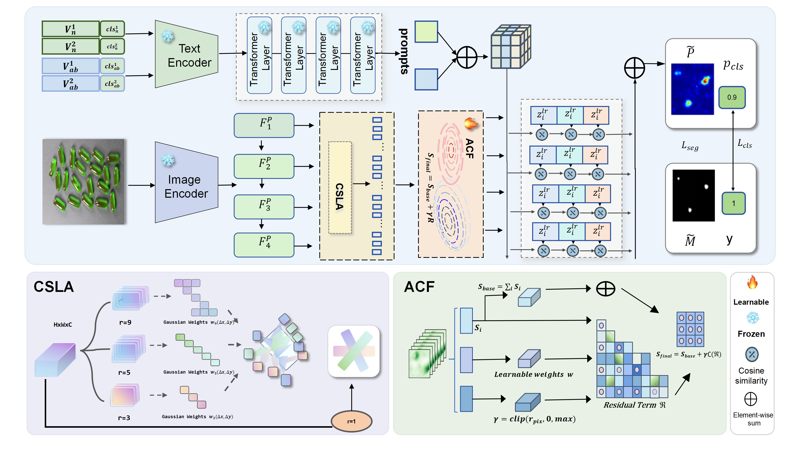

# LOGIC-AD

PyTorch implementation of **LOGIC-AD: Cross-Domain Zero-Shot Anomaly Detection via Logit-Space Consistency**.

<p align="center">
  
  <br>
  <em>Overview of LOGIC-AD. zero-shot anomaly segmentation results are shown for cross-domain evaluation.</em>
</p>

---

## 📌 Overview

LOGIC-AD is a **cross-domain zero-shot anomaly detection** framework that enforces **logit-space consistency** to improve generalization across unseen domains.  
This repository provides a complete PyTorch training and evaluation pipeline for reproducing the results in the paper.

---

## 📂 Dataset Preparation

Please organize your dataset directory as follows. Ensure the folder structure strictly matches the layout below:

```text
data_dir/
├── Br35H
│   ├── no
│   └── yes
├── BrainMRI
│   ├── no
│   └── yes
├── btad
│   ├── 01
│   │   ├── ground_truth
│   │   │   └── ko
│   │   ├── test
│   │   │   ├── ko
│   │   │   └── ok
│   │   └── train
│   │       └── ok
│   ├── ...
├── CVC-ClinicDB
│   ├── images
│   └── masks
├── CVC-ColonDB
│   ├── images
│   └── masks
├── DAGM_KaggleUpload
│   ├── Class1
│   │   ├── Test
│   │   │   └── Label
│   │   └── Train
│   │       └── Label
│   ├── ...
├── MPDD
│   ├── blacket_black
│   │   ├── ground_truth
│   │   │   └── hole
│   │   │   └── scratches
│   │   ├── test
│   │   │   ├── hole
│   │   │   └── good
│   │   │   └── scratches
│   │   └── train
│   │       └── good
│   ├── ...
├── ISIC2016
│   ├── ISBI2016_ISIC_Part1_Test_Data
│   └── ISBI2016_ISIC_Part1_Test_GroundTruth
├── Kvasir
│   ├── images
│   └── masks
├── mvtec_3d  
│   ├── bagel
│   │   ├── calibration
│   │   ├── test
│   │   │   ├── combined
│   │   │   ├── contamination
│   │   │   ├── crack
│   │   │   ├── hole
│   │   │   └── good
│   │   └── train
│   │       └── good
│   ├── ...
├── visa
│   ├── candle
│   │   └── Data
│   │       ├── Images
│   │       │   ├── Anomaly
│   │       │   └── Normal
│   │       └── Masks
│   │           └── Anomaly
│   ├── ...
│   └── split_csv
